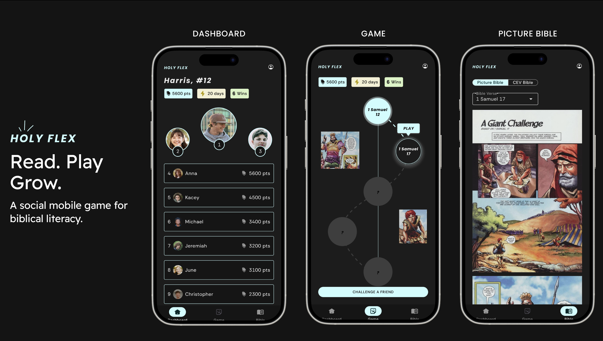
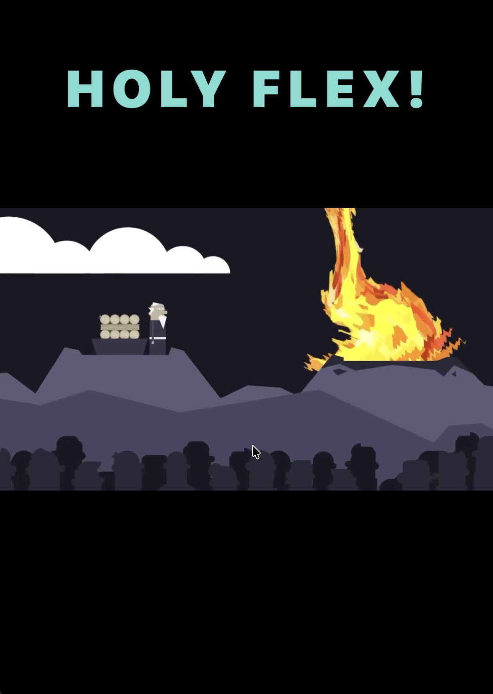
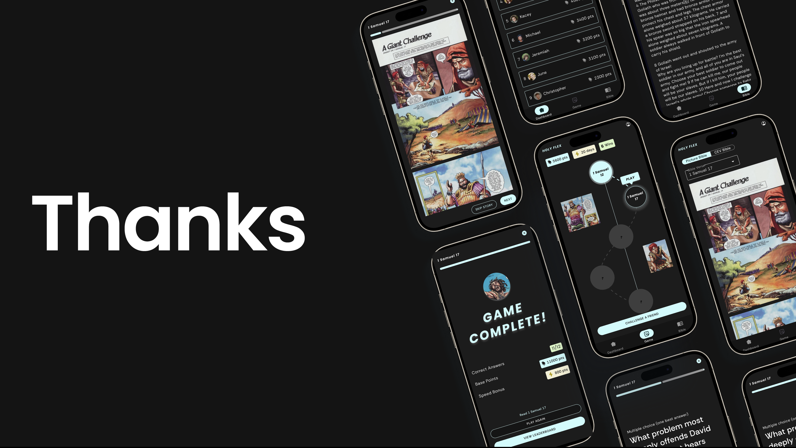

# Holy Flex

A Bible quiz game built with Flutter that challenges players to test their knowledge of Scripture through engaging, timed questions.

## Screenshots

<p align="center">
  
  <br>
  <em>Splash Screen, Game Map, and Quiz Interface</em>
</p>

<p align="center">
  
  <br>
  <em>HOLY FLEX Celebration Animation</em>
</p>

<p align="center">
  
  <br>
  <em>Results and Score Breakdown</em>
</p>

## Features

- **Interactive Bible Quiz**: Answer questions about biblical stories with a 60-second timer per question
- **Story-Based Learning**: Read illustrated Bible stories before taking quizzes
- **Multiple Levels**:
  - Genesis
  - David and Goliath (1 Samuel 17)
  - More levels coming soon
- **Scoring System**: Earn 1000 points per correct answer
- **Beautiful UI**: Modern dark theme with cyan accents
- **Canadian Bible Society**: Official partnership and branding

## Game Screens

### Splash Screen
- Welcome screen with CBS (Canadian Bible Society) logo
- Tap anywhere to continue to the dashboard

### Dashboard
- Track your total points, streak, and wins
- Access game map and Bible reading

### Game Map
- Visual progression through Bible stories
- Unlock new levels as you complete quizzes
- Interactive node-based navigation

### Quiz
- 60 seconds per question
- Multiple choice answers
- Immediate feedback on correctness
- Progress tracking

### Results
- View your score breakdown
- Celebrate with "HOLY FLEX!" animation
- Challenge friends or view leaderboard

## Technical Details

### Built With
- **Flutter 3.35.7** - Cross-platform framework
- **Dart 3.9.2** - Programming language
- **Provider** - State management
- **Shared Preferences** - Local data persistence
- **Video Player** - Celebration animations

### Platforms
- ✅ macOS (Primary)
- 🔄 iOS (Planned)
- 🔄 Android (Planned)

### Project Structure
```
lib/
├── data/               # JSON question banks
├── models/             # Data models (Question, GameSession, etc.)
├── screens/            # UI screens
├── services/           # Business logic (GameService, QuestionService)
├── theme/              # App theme and styling
└── widgets/            # Reusable UI components

assets/
├── images/             # UI images, story illustrations
├── elijah_ko.mp4      # Celebration video
└── ...
```

## Getting Started

### Prerequisites
- Flutter SDK 3.35.7 or higher
- Dart 3.9.2 or higher
- macOS (for macOS development)
- Xcode 26.0+ (for macOS builds)

### Installation

1. Clone the repository:
```bash
git clone https://github.com/thral1/holy-flex.git
cd holy_flex
```

2. Install dependencies:
```bash
flutter pub get
```

3. Run on macOS:
```bash
flutter run -d macos
```

### Building for Release

```bash
flutter build macos --release
```

The built app will be in `build/macos/Build/Products/Release/holy_flex.app`

## Configuration

### Window Size
The app opens with a fixed window size:
- Width: 600 points
- Height: Full screen height (vertically maximized)
- Position: Horizontally centered

This can be modified in `macos/Runner/MainFlutterWindow.swift`

### Quiz Settings
Timer and scoring can be adjusted in `lib/services/game_service.dart`:
- `questionTimeSeconds`: Time per question (currently 60s)
- `basePoints`: Points per correct answer (currently 1000)

### Adding New Questions

Questions are stored in JSON files in `lib/data/`. Example format:

```json
{
  "questions": [
    {
      "id": "unique_id",
      "text": "Question text?",
      "choices": [
        "Option A",
        "Option B",
        "Option C",
        "Option D"
      ],
      "correctIndex": 2,
      "explanation": "Explanation of the answer",
      "category": "Bible Reference",
      "difficulty": 2
    }
  ]
}
```

## Roadmap

- [ ] iOS/Android support
- [ ] More Bible story levels
- [ ] Multiplayer challenges
- [ ] Leaderboard integration
- [ ] Achievement system
- [ ] Audio narration for stories
- [ ] Offline mode improvements

## Contributing

This is a Canadian Bible Society project. For contributions or questions, please open an issue or pull request.

## License

Copyright © 2025 Canadian Bible Society. All rights reserved.

## Acknowledgments

- Canadian Bible Society for partnership and content
- Bible story illustrations from FreeBibleImages
- Flutter team for the amazing framework
